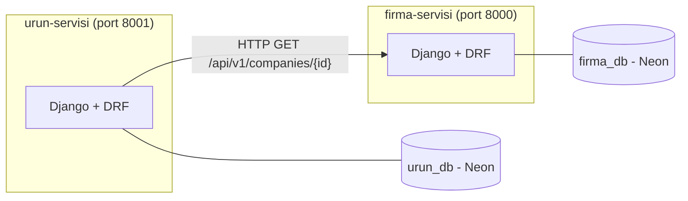

# firma-servisi

## Bu proje nedir, ne yapıyor

`firma-servisi`, firma kayıtlarını (unvan, vergi numarası, durum) yöneten bağımsız bir mikroservistir. Firma
oluşturma, listeleme, detay görüntüleme ve durum güncelleme (aktif/pasif) işlemlerini bir REST API üzerinden
sunar. Kendi veritabanına sahiptir ve başka hiçbir servise bağımlı değildir.

## Nasıl çalıştırılır

### Gereken paketler

```bash
pip install -r requirements.txt
```

### .env dosyası

Proje kök dizininde bir `.env` dosyası oluşturun, şu değişkenleri içermeli:

DB_NAME=<neon-veritabani-adi>
DB_USER=<neon-kullanici-adi>
DB_PASSWORD=<neon-sifresi>
DB_HOST=<neon-host-adresi>
DB_PORT=5432


### Komutlar

```bash
python -m venv .venv
.venv\Scripts\Activate.ps1          # Windows
pip install -r requirements.txt
python manage.py migrate
python manage.py runserver
```

### Port

Bu servis varsayılan olarak **8000** portunda çalışır: `http://127.0.0.1:8000`

## Mimari

İki bağımsız mikroservis vardır: `firma-servisi` ve `urun-servisi`. Her biri kendi veritabanına sahiptir,
birbirinin veritabanına doğrudan erişemez. `urun-servisi`, ürün oluştururken bu servise HTTP üzerinden
soru sorar ("bu firma var mı, aktif mi?").



## Uçların listesi

| Adres | Metot | Ne yapar |
|---|---|---|
| `/api/v1/companies` | GET | Firmaları sayfalı olarak listeler |
| `/api/v1/companies` | POST | Yeni firma oluşturur |
| `/api/v1/companies/{id}` | GET | Tek bir firmanın detayını döner |
| `/api/v1/companies/{id}` | PATCH | Firmanın durumunu (active/passive) günceller |

## Aldığım kararlar ve gerekçeleri

- **Firma silinmiyor, pasifleştiriliyor:** `company_id`, `urun-servisi` gibi başka servislerde referans
  olarak tutulduğu için, firma silinirse bu referanslar sahipsiz kalırdı. Pasifleştirme, veriyi korurken
  işlemi durdurmayı sağlıyor.
- **Vergi numarası tekilliği servis katmanında kontrol ediliyor:** Modeldeki `unique=True` kısıtı DRF
  tarafından otomatik olarak serializer'a taşınıyordu; bu, iş kuralının yanlış katmanda yaşamasına yol
  açıyordu. Kontrolü servise taşıyıp modeldeki kısıtı da (son bir güvenlik ağı olarak) koruduk.
- **Hata cevapları tek biçimde:** Tüm hatalar `{"error": {"code", "message", "details"}}` biçiminde
  dönüyor, böylece istemci hangi hatayla karşılaştığını mesaj metnini yorumlamadan, sabit bir koda
  bakarak anlayabiliyor.
- **Sayfalama ve filtreleme veritabanı seviyesinde:** Tüm kayıtları çekip Python'da kesmek yerine,
  `LIMIT`/`OFFSET` ile veritabanına sadece istenen sayfa sorgulatılıyor; büyük veri setlerinde performans
  sorununu baştan önlüyor.
- **Testler SQLite'a bağlanıyor, Neon'a değil:** `settings.py`, `pytest` ile çalıştırıldığını algılayıp
  veritabanını anlık olarak SQLite'a çeviriyor; böylece testler gerçek veriyi bozma riski taşımadan,
  hızlı ve izole çalışıyor.
- **Geniş hata yakalama (`except Exception`) hiçbir yerde kullanılmıyor:** Her hata spesifik bir sınıfla
  yakalanıyor; bu, gerçek bir bug'ın yanlışlıkla "beklenen hata" gibi gizlenmesini engelliyor.
- **Tip bildirimleri tüm fonksiyon imzalarına eklendi:** Fonksiyonların ne aldığı ve ne döndürdüğü, kodu
  çalıştırmadan, sadece imzaya bakarak anlaşılabiliyor.

## Dokümana önerdiğim eklemeler

Standartlar dokümanının 3.3 bölümünde karşılığı olmayan, karşılaştığımız durum kodları için öneriler:

- **204 No Content:** Bir kaynak başarıyla silindiğinde, dönecek bir gövde olmadığını belirtmek için
  kullanılmalı.
- **503 Service Unavailable:** İstek ve kodumuz doğru olduğu hâlde, bağımlı olunan başka bir servise
  ulaşılamadığında veya zaman aşımına uğradığında kullanılmalı.
- **401 Unauthorized:** İsteğin kimlik bilgisi eksik veya geçersiz olduğunda kullanılmalı.